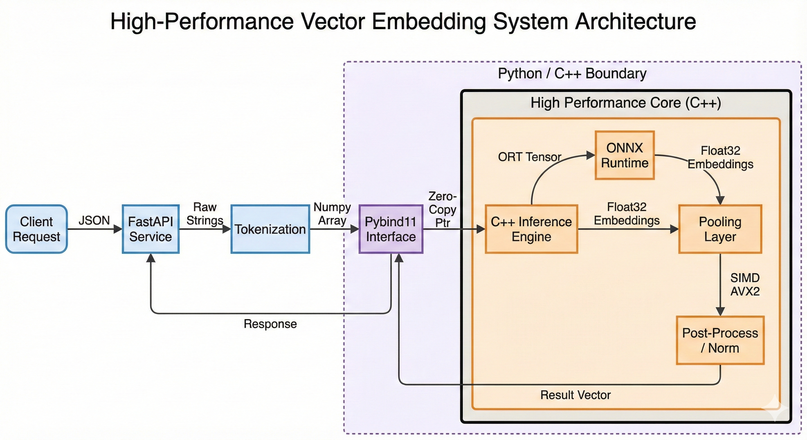

# Flash-Embedding


## 📖 项目简介

**Flash-Embedding** 是一个针对高并发场景设计的高性能向量化推理与评测系统。

针对传统 Python 推理服务在高并发场景下存在的 GIL 瓶颈与高延迟问题，本项目设计并实现了一个 **C++ Native Extension** 架构。核心计算链路采用 modern C++ (14/17) 重构，利用 Pybind11 提供对 Python 的无缝接口支持。通过底层优化，本系统实现了比原生 PyTorch 方案显著的性能提升。

## 🛠️ 技术栈

- **Core**: C++14/17/20, OpenMP
- **Binding**: Pybind11
- **Acceleration**: SIMD (AVX2), ONNX Runtime (C++ API)
- **Service**: Python (FastAPI), Docker
- **Testing**: PyTest, Locust

## 📂 文件结构

```text
FlashEmbed-Cpp/
├── src/                # C++ 核心源码
├── include/            # C++ 头文件
├── python/             # Python 绑定与服务代码
├── tests/              # 测试套件 (C++ & Python)
├── benchmarks/         # 性能基准测试
├── docs/               # 项目文档
├── CMakeLists.txt      # 构建配置
└── README.md           # 项目说明
```

## 📅 开发计划 (Roadmap)

本项目开发分为四个阶段，当前进展如下：

- [x] **Phase 0: 项目初始化与基建** (Focus: Scaffold, CMake, CI/CD)
- [ ] **Phase 1: 核心算子与 SIMD 加速** (Focus: AVX2, Strategy Pattern)
- [ ] **Phase 2: 推理引擎集成** (Focus: ONNX Runtime, Zero-Copy)
- [ ] **Phase 3: 服务化与全链路优化** (Focus: FastAPI, Dynamic Batching)

👉 [查看详细开发路线图](docs/roadmap.md)

## 🏗️ 系统架构

为了实现极致的性能与灵活性，系统采用了多层解耦设计。下方数据流展示了从 Python 请求到 C++ 算子加速的全链路过程：



👉 [查看详细微服务架构设计](docs/architecture.md)

## 💻 核心代码展示 (Show Me The Code)

Talk is cheap. 这里精选了部分核心实现的源码片段，展示 C++ 底层优化细节：

- **[Zero-Copy Data Transfer](docs/code_snippets.md#1-pybind11-zero-copy-实现)**: 利用 Pybind11 Buffer Protocol 实现 Numpy 到 C++ 的内存直通。
- **[SIMD AVX2 Kernel](docs/code_snippets.md#2-avx2-simd-kernel-cosine-similarity)**: 手写 AVX2 Intrinsics 实现余弦相似度计算加速。
- **[Thread-Safe Memory Pool](docs/code_snippets.md#3-线程安全的内存池-thread-safe-memory-pool)**: 基于 RAII 的资源管理策略。

## 🛠️ 工程难点与开发日志

本项目不仅是对算法的复现，更是对底层系统编程难题的攻克记录。我们在开发过程中解决了诸多工程挑战：

- **[SIMD 内存对齐陷阱](docs/dev_log.md#1-内存管理与对齐-memory-alignment-in-simd)**: 解决 AVX2 `load_ps` 导致的 Segmentation Fault 问题。
- **[Python/C++ 生命周期冲突](docs/dev_log.md#2-pybind11-生命周期管理-object-lifecycle--ref-counting)**: 解决异步推理场景下的悬垂指针与引用计数问题。
- **[多线程资源争抢](docs/dev_log.md#3-onnx-runtime-的多线程冲突)**: 优化 OpenMP 与 ORT 线程池的调度策略。

👉 [阅读完整开发日志](docs/dev_log.md)

## 🌟 技术亮点与架构细节

本项目采用分层架构设计，重点优化了数据传输、算子计算与并发处理能力。详细技术实现请参考以下文档：

### 1. C++ 底层优化 (AI Infra)
- **零拷贝数据传输 (Zero-Copy)**
  基于 Pybind11 实现 Numpy 到 C++ 的内存直通，消除百万级向量传输开销。
  👉 [内存管理与传输优化详情](docs/memory_optimization.md)

- **SIMD 并行加速**
  采用策略模式 (Strategy Pattern) 自动检测 CPU 指令集，运行时切换 AVX2 内核。
  👉 [SIMD 算子加速详解](docs/simd_optimization.md)

- **资源管理**
  利用 RAII 机制与智能指针管理推理引擎生命周期，确保内存安全。

### 2. 模型推理与服务 (System Design)
- **高性能推理引擎**
  集成 ONNX Runtime C++ API，利用 OpenMP 实现算子级并行，突破 GIL 限制。
  👉 [推理引擎设计文档](docs/inference_engine.md)

- **全链路 Pipeline**
  封装 "Tokenization -> Inference -> Pooling" 完整链路，支持 Dynamic Batching。
  👉 [微服务架构设计](docs/architecture.md)

## 📊 量化指标

| 指标项 | 优化前 (Python/PyTorch) | 优化后 (C++ Native) | 提升幅度 |
| :--- | :--- | :--- | :--- |
| **QPS (Throughput)** | *TBD* | *TBD* | *Wait for Benchmark* |
| **Cosine Similarity Latency** | *Base* | *Reduced* | **~40%** (预计) |
| **Memory Overhead** | *High* | *Low* | *Significant Drop* |

> 注：具体性能数据将在项目构建完成后通过 Benchmark 工具实测填充。

## 🧪 测试与质量保障

为了确保系统的高可用性与计算正确性，我们构建了完整的自动化测试体系：

- **精度对齐 (Consistency Test)**: 确保 C++ 算子与 PyTorch 原生算子误差 < 1e-5。
- **A/B 性能对比**: 自动化生成 Latency/Throughput 热力图。
- **压力测试**: 使用 Locust 模拟高并发流量。

👉 [查看测试策略与基准报告](docs/testing_benchmarks.md)

## 🚀 快速开始

本项目采用现代化的工程配置：使用 **Conda** 管理 C++ 依赖（如 OpenMP, ONNX Runtime），使用 **scikit-build-core** 驱动 CMake 构建。

### 1. 环境准备

推荐使用 Mamba (C++ 实现的 Conda 加速版) 或 Conda 创建环境。这会自动配置好所有 C++ 编译器和依赖库。

```bash
# 选项 A: 使用 Mamba (推荐，速度快)
mamba env create -f environment.yml
mamba activate flash-embed

# 选项 B: 使用 Conda
conda env create -f environment.yml
conda activate flash-embed
```

### 2. 编译与安装

得益于 `pyproject.toml` 的配置，你可以直接使用 pip 触发 CMake 编译流程：

```bash
# 编译 C++ 扩展并以开发模式安装
# 这会自动调用 CMake 和 Ninja 进行编译
pip install --no-build-isolation -v -e .
```

### 3. 运行测试

```bash
# 运行 C++ 单元测试 (需先手动构建 test target)
cmake -S . -B build -G Ninja
cmake --build build --target test

# 运行 Python 集成测试
pytest tests/
```
